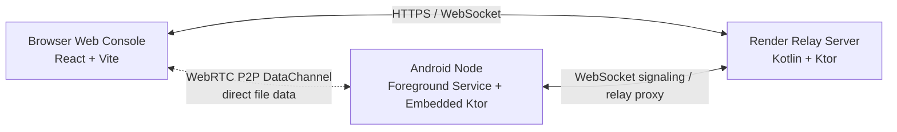

|  |
|:--:|
| <h1 id="project-header">Easy Storage Cloud</h1> |
| <em>Your phone. Your cloud. Your data.</em> |
|        |
| Easy Storage Cloud transforms an Android device into a self-hosted personal cloud and lightweight NAS node that can be reached from any modern browser. The project combines an embedded Kotlin/Ktor server on Android, a React + Vite web console, and a Kotlin/Ktor relay deployed on Render that handles signaling, remote reachability, and fallback proxying when direct connectivity is unavailable. Its primary happy path is browser-to-device file transfer over WebRTC data channels, so your phone stays the storage source of truth while the relay provides public discovery and transport negotiation. |

## Table of Contents
1. [Features](#features)
2. [Architecture Overview](#architecture-overview)
3. [Tech Stack](#tech-stack)
4. [Project Structure](#project-structure)
5. [Prerequisites](#prerequisites)
6. [Getting Started](#getting-started)
7. [Configuration](#configuration)
8. [API Reference](#api-reference)
9. [File Transfer Pipeline](#file-transfer-pipeline)
10. [Real-Time Transfer Indicator](#real-time-transfer-indicator)
11. [Known Issues and Limitations](#known-issues-and-limitations)
12. [Roadmap](#roadmap)
13. [Contributing](#contributing)
14. [Security Considerations](#security-considerations)
15. [Performance](#performance)
16. [License](#license)
17. [Acknowledgements](#acknowledgements)
18. [Contact and Support](#contact-and-support)

## Features
### Core Storage
| Implemented | In Progress |
|:--|:--|
| ✅ Direct storage access through Android SAF (`DocumentFile`) without root |  |
| ✅ File upload for single files and nested folder trees with structure preservation |  |
| ✅ File download with MIME-aware `Content-Type` handling |  |
| ✅ Folder creation, soft delete to `.Trash`, and bulk file actions |  |
| ✅ Real-time file listing with name, size, path, and modified timestamp metadata |  |
| ✅ Drive health monitoring with used, free, total, and percentage utilization |  |

### Transfer Architecture
| Implemented | In Progress |
|:--|:--|
| ✅ WebRTC P2P data channels for direct browser-to-device transfer |  |
| ✅ Relay server fallback when P2P negotiation fails |  |
| ✅ Chunked upload with `5 MB` application chunks for large-file support |  |
| ✅ Range request support for video/audio seeking via `HTTP 206 Partial Content` |  |
| ✅ Live transfer progress published from Android-side registries and surfaced in the UI |  |
| ✅ Internal `64 KB` WebRTC packet slicing to keep DataChannel memory stable |  |

### Web Console
| Implemented | In Progress |
|:--|:--|
| ✅ Dark-mode React SPA with a desktop-first multi-panel console |  |
| ✅ File badges, icons, and per-type visual treatment |  |
| ✅ Drag-and-drop upload flow and folder upload preflight manifest |  |
| ✅ File search, sorting, and list/grid views |  |
| ✅ Node online/offline polling with reconnect and relay fallback awareness |  |
| ✅ Upload progress panel with per-file and overall progress |  |

### Android App
| Implemented | In Progress |
|:--|:--|
| ✅ Foreground service keeps the node alive in the background |  |
| ✅ Remote tunnel toggle with QR-based sharing and public link generation |  |
| ✅ Live node health metrics for CPU, memory, ping, and storage state |  |
| ✅ Native transfer card overlay for active WebRTC transfers |  |
| ✅ Settings for relay endpoint, storage root, permissions, and device state |  |
| ✅ Embedded WebView console served from app assets for in-app management |  |

### In Progress
| Implemented | In Progress |
|:--|:--|
|  | 🚧 File preview for images, PDF, video, and source code with syntax highlighting |
|  | 🚧 Supabase authentication and multi-tenancy |
|  | 🚧 Automatic photo backup |
|  | 🚧 Version history |
|  | 🚧 Play Store release |

## Architecture Overview


Easy Storage Cloud is built as a three-layer system. The Android phone is the storage authority, the relay makes that phone reachable over the public internet, and the web console provides a browser-native control plane. In normal operation the browser and phone negotiate a direct WebRTC channel, so file bytes can bypass the relay entirely. When that is not possible, the relay proxies `/api/*` requests over a persistent WebSocket tunnel to the phone.

### Layer 1 — Android Node (Kotlin + Ktor)
The Android application runs an embedded Ktor server inside `ServerService.kt` as a foreground service on port `8080`. It owns file listing, chunk upload handling, download streaming with range support, storage statistics, folder manifest pre-creation, folder finalization, and transfer status reporting. All filesystem access goes through Android's Storage Access Framework and `DocumentFile`, which means the node can operate against user-approved storage roots on stock Android devices without root access. When the node starts, it also opens a WebSocket tunnel to the relay and registers the current `shareCode` so remote browsers can find it.

### Layer 2 — Relay Server (Kotlin + Ktor on Render)
The relay is intentionally small: it is a signaling broker, public reachability layer, and HTTP fallback proxy. Its most important job is WebRTC negotiation, forwarding SDP offers, answers, and ICE candidates between the browser and the Android node. When P2P connectivity succeeds, the relay carries zero file bytes. In the current beta fallback path, however, request and response bodies are serialized into Base64 relay envelopes, so the proxy path is functional but not yet fully streaming; that is one of the known areas being hardened. The relay keeps a `ConcurrentHashMap` of connected agents and browsers, runs Ktor WebSockets with a server-side ping period, and also emits an explicit `25` second agent ping loop to reduce the chance of Render idle timeouts dropping long-lived sessions.

### Layer 3 — Web Console (React + Vite)
The web console is a React SPA used in two places: it is bundled into the Android app for the in-app WebView experience, and it is also published as static assets from the relay so any browser can open the remote console. Routing is hash-based through `createHashRouter`, which avoids server-side rewrite complexity on the relay. The `useWebRTC` hook manages signaling, offer/answer exchange, ICE candidate handling, DataChannel lifecycle, and fallback transitions. File operations are presented to the UI through a unified client-side access layer composed of `useWebRTC`, `P2PTransport`, and shared request helpers inside `WebConsole.tsx`, so the console can talk either directly to the Android node or through the relay with the same user flow.

## Tech Stack
| Layer | Technology | Purpose |
|:--|:--|:--|
| Android app | Kotlin | Native application logic and embedded server host |
| Android app | Ktor | Embedded HTTP server for file APIs on the phone |
| Android app | Android SAF / `DocumentFile` | Rootless scoped storage access |
| Android app | Jetpack Compose | Native Android UI shell and overlays |
| Android app | Coroutines | Async background work and server tasks |
| Android app | StateFlow | Live transfer and tunnel state propagation |
| Android app | OkHttp WebSocket | Persistent relay tunnel client |
| Relay server | Kotlin | Server implementation language |
| Relay server | Ktor + Netty | HTTP routing, WebSockets, static hosting |
| Relay server | WebSocket | Signaling and fallback proxy transport |
| Relay server | `ConcurrentHashMap` | Connected node and browser session registry |
| Relay server | Render | Public cloud hosting for the relay |
| Web console | React 18 | SPA component model |
| Web console | Vite | Frontend build and dev tooling |
| Web console | TypeScript | Typed browser-side application code |
| Web console | React Router | Hash-based routing for remote and in-app console flows |
| Web console | Framer Motion / `motion` | Animations and UI transitions |
| Web console | Lucide Icons | File, status, and navigation iconography |
| Web console | Sonner | Toast notifications |
| Web console | WebRTC API | P2P data channel connectivity |
| Build tooling | Gradle | Android and relay builds |
| Build tooling | npm + Vite | Web console dependency management and bundling |

## Project Structure
```text
easy-storage-cloud/
├── README.md                                     # Primary project documentation
├── build.gradle.kts                              # Root Gradle build for the native Android + relay modules
├── settings.gradle.kts                           # Root Gradle settings
├── package.json                                  # Root scripts, including UI-to-Android asset sync
├── package-lock.json                             # Root npm lockfile
├── render.yaml                                   # Render deployment blueprint for the relay
├── docs/                                         # Architecture, deployment, and app-link notes
│   ├── DESIGN.md                                 # Detailed system design document
│   ├── relay-architecture.md                     # Relay rationale and deployment shape
│   ├── relay-runbook.md                          # Local relay runbook
│   ├── public-deployment-render.md               # Render deployment guide
│   └── app-links-setup.md                        # Android deep-link configuration notes
├── app/                                          # Primary Android node application module
│   ├── build.gradle.kts                          # Android app build, Ktor, WebRTC, and BuildConfig setup
│   └── src/
│       ├── debug/
│       │   ├── AndroidManifest.xml               # Debug manifest overlays
│       │   └── java/com/pratham/cloudstorage/
│       │       ├── DebugCommandReceiver.kt       # Debug-only broadcast hooks
│       │       └── DebugStartActivity.kt         # Debug start activity
│       └── main/
│           ├── AndroidManifest.xml               # App manifest and service declarations
│           ├── assets/web/                       # Built React console bundled into the APK
│           │   ├── index.html                    # App-served web console entrypoint
│           │   ├── favicon.svg                   # Console favicon
│           │   └── assets/                       # Generated JS/CSS bundles copied from `ui/dist`
│           ├── java/com/pratham/cloudstorage/
│           │   ├── MainActivity.kt               # Compose shell, WebView bridge, node lifecycle
│           │   ├── ServerService.kt              # Embedded Ktor server and Android node API
│           │   ├── RelayTunnelClient.kt          # Relay WebSocket tunnel client
│           │   ├── WebRTCPeer.kt                 # Android-side WebRTC responder and DataChannel handler
│           │   ├── TransferManager.kt            # Aggregate transfer state for native overlays
│           │   ├── TransferRegistry.kt           # Chunk-upload registry for HTTP uploads
│           │   ├── ServerUtils.kt                # URL, share-code, and networking helpers
│           │   └── ui/theme/
│           │       ├── Color.kt                  # Compose color palette
│           │       ├── Theme.kt                  # Compose theme wiring
│           │       └── Type.kt                   # Compose typography setup
│           └── res/                              # Android resources, icons, and themes
├── relay/                                        # Public relay and signaling service
│   ├── build.gradle.kts                          # Relay Gradle build
│   ├── Dockerfile                                # Container image used by Render
│   ├── settings.gradle.kts                       # Standalone relay Gradle settings
│   └── src/main/
│       ├── kotlin/com/pratham/cloudstorage/relay/
│       │   └── RelayServer.kt                    # Relay routing, signaling registry, proxy logic
│       └── resources/
│           ├── static/                           # Static assets served by the relay
│           │   ├── index.html                    # Published web console shell
│           │   ├── favicon.svg                   # Relay-served favicon
│           │   └── assets/                       # Bundled JS/CSS
│           └── web/                              # Alternate packaged frontend assets
├── ui/                                           # React + Vite web console source
│   ├── package.json                              # Frontend scripts and dependencies
│   ├── package-lock.json                         # Frontend lockfile
│   ├── vite.config.ts                            # Vite configuration
│   ├── index.html                                # Frontend HTML template
│   ├── public/
│   │   └── favicon.svg                           # Public favicon
│   └── src/
│       ├── app/
│       │   ├── App.tsx                           # Root app bootstrap and state bridge
│       │   ├── bridge.ts                         # `window.Android` interface bindings
│       │   ├── routes.ts                         # Hash router configuration
│       │   ├── hooks/
│       │   │   ├── useWebRTC.ts                  # Browser-side WebRTC lifecycle hook
│       │   │   └── p2pTransport.ts               # DataChannel request/response transport
│       │   └── components/
│       │       ├── Root.tsx                      # Router outlet
│       │       ├── LoadingScreen.tsx             # Boot/loading screen
│       │       ├── TransferIndicatorBar.tsx      # Remote transfer progress banner
│       │       ├── TransfersPage.tsx             # Full transfer list view
│       │       ├── android/
│       │       │   ├── AndroidDashboard.tsx      # In-app dashboard
│       │       │   ├── AndroidBrowser.tsx        # In-app file browser
│       │       │   ├── AndroidOnboarding.tsx     # Android onboarding flow
│       │       │   ├── AndroidSettings.tsx       # Mobile settings screen
│       │       │   ├── FileDetails.tsx           # Android file detail sheet
│       │       │   ├── ShareLinkScreen.tsx       # Invite/share screen
│       │       │   ├── ShareQRDialog.tsx         # QR sharing dialog
│       │       │   └── WelcomeScreen.tsx         # First-run welcome screen
│       │       ├── web/
│       │       │   ├── WebConsole.tsx            # Desktop/tablet remote web console
│       │       │   ├── PreviewModal.tsx          # File preview modal
│       │       │   ├── PreviewManager.ts         # Preview capability helpers
│       │       │   ├── animated-folder.css       # Folder animation styles
│       │       │   └── node-skeleton.css         # Skeleton loading styles
│       │       ├── figma/
│       │       │   └── ImageWithFallback.tsx     # Utility image component
│       │       └── ui/                           # Shared shadcn/Radix UI primitives
│       ├── styles/                               # Global CSS theme and console styles
│       └── imports/pasted_text/                  # Design references imported during UI iteration
├── android/                                      # Capacitor-generated Android wrapper and resources
│   ├── app/                                      # Capacitor Android app shell
│   ├── build.gradle                              # Capacitor Android build
│   ├── settings.gradle                           # Capacitor Android settings
│   └── variables.gradle                          # Capacitor Android variables
├── ios/                                          # Capacitor iOS wrapper and plugin scaffolding
├── github-pages/                                 # Static pages for join/share flows
└── stitch-designs/                               # Design exploration HTML and exported mockups
```

## Prerequisites
Before setting up the project, make sure the following are in place:

- Android device running Android `8.0+` (`API 26+`) with enough free storage for the data you intend to expose.
- USB debugging enabled if you plan to build and install directly from Android Studio.
- Android Studio Hedgehog or newer, or IntelliJ IDEA for the relay module.
- JDK `17+` available for modern Gradle and relay builds.
- Node.js `18+` and npm `9+`.
- Kotlin `1.9+` toolchain support.
- A Render account if you want a public relay deployment.
- Basic familiarity with Kotlin, React, Gradle, and command-line builds.

## Getting Started
### 8.1 Clone the Repository
```bash
git clone https://github.com/bbethical010-glitch/cloudsto.git
cd cloudsto
```

### 8.2 Set Up the Relay Server
1. Open the repository root in Android Studio or IntelliJ IDEA so the `relay` module is available.
2. Verify the relay starts locally before deploying it.

```bash
./gradlew :relay:run
```

3. Confirm the local health endpoint responds.

```bash
curl http://127.0.0.1:8787/health
```

4. Deploy the relay to Render. The repository already includes `render.yaml`, but if you create a manual Web Service the equivalent build and start commands are:

```bash
./gradlew :relay:installDist
```

```bash
./relay/build/install/relay/bin/relay
```

5. In Render:
   - Create a new Web Service.
   - Connect the GitHub repository.
   - Set the build command shown above.
   - Set the start command shown above.
   - Or use the included `render.yaml` to deploy the Docker-based blueprint automatically.
6. Note the deployed URL, for example `https://easy-storage-relay.onrender.com`.

### 8.3 Set Up the Android App
1. Open the same repository in Android Studio and select the root project so the `app` module is available.
2. Create or update `local.properties` with your relay endpoint.

```properties
RELAY_BASE_URL=https://YOUR-RENDER-URL.onrender.com
APP_LINK_HOST=invite.easystoragecloud.app
```

3. Install frontend dependencies, then build and copy the web console into the Android assets directory.

```bash
cd ui
npm install
cd ..
npm run build:ui
```

4. Build and install the Android APK.

```bash
./gradlew :app:assembleDebug
```

```bash
./gradlew :app:installDebug
```

5. Launch the app on the Android device.
6. Grant the requested media and storage permissions.
7. Select the storage root through the system folder picker.
8. Start the node from the dashboard and confirm that the relay tunnel reaches `Connected`.

### 8.4 Access the Web Console
1. Open the relay URL in any browser.
2. Enter or paste the `nodeId` / share code displayed by the Android app.
3. Use the direct console URL if you want to skip the landing page.

```text
https://YOUR-RENDER-URL.onrender.com/#/console/YOUR_NODE_ID
```

4. A healthy session should show the node as online and permit file listing immediately after the relay reports the agent as connected.

## Configuration
| Setting | Where It Is Set | Default | What It Controls | If It Is Wrong |
|:--|:--|:--|:--|:--|
| `RELAY_BASE_URL` | `local.properties`, Android `BuildConfig`, Android settings screen, `SharedPreferences` key `relay_base_url` | `https://easy-storage-relay.onrender.com` | Public base URL used to reach the relay, build invite links, and open the agent WebSocket | Remote access, signaling, and relay fallback fail |
| Agent WebSocket path | Derived in `RelayTunnelClient.toWebSocketUrl()` | `/agent/connect?shareCode=<SHARE_CODE>` | Android node registration and fallback tunnel connection | The phone cannot register with the relay |
| Browser signaling path | Derived in `useWebRTC.ts` | `/signal/{shareCode}` | Browser-side WebRTC signaling socket | P2P negotiation never starts |
| Android node HTTP port | Kotlin constant `DEFAULT_PORT` in `ServerUtils.kt` | `8080` | Local Ktor server bind port | WebView, local API access, and relay forwarding break |
| HTTP upload chunk size | React constants in `WebConsole.tsx` and `AndroidBrowser.tsx`; Kotlin mirror in `ServerService.kt` | `5 * 1024 * 1024` bytes | Application-level upload slicing for large files | Upload offsets, progress math, and chunk finalization become inconsistent |
| P2P packet chunk size | `CHUNK_SIZE` in `p2pTransport.ts` and `WebRTCPeer.kt` | `64 * 1024` bytes | DataChannel packet size used during P2P transfers | Large transfers may become unstable or memory-heavy |
| WebRTC stage timeouts | `useWebRTC.ts` | `3s` offer, `5s` ICE, `6s` DataChannel open | Browser fallback policy from P2P to relay | Slow peers may fall back too early, or failures may hang too long |
| Relay WebSocket timeout | `RelayServer.kt` Ktor WebSocket config | `60s` | Server-side WebSocket timeout window | Idle sessions may disconnect unexpectedly |
| Ping interval | Explicit agent ping loop in `RelayServer.kt` plus Ktor ping periods | `25s` explicit agent ping, `20s` relay WS ping period, `15s` Android OkHttp ping | Keeps Render and long-lived sockets active | Connections can be dropped during inactivity windows |
| SAF storage root URI | Android `SharedPreferences` key `selected_uri` | No default until user chooses a folder | Filesystem root exposed by the node | File APIs return not found or storage unavailable |
| Node ID / share code generation | `generateShareCode()` in `ServerUtils.kt`, persisted as `share_code` | Random uppercase 10-character code | Public node identifier used by browsers and the relay | Browser sessions cannot target the correct node |
| Render service port | Environment variable `PORT` | `8787` locally, Render-assigned in production | Relay bind port | Relay health checks and service boot fail |

## API Reference
The node API below reflects the current beta code in `ServerService.kt`. Where the implementation differs from an idealized public contract, that difference is called out explicitly so this README stays accurate.

### GET /api/files
Lists directory contents beneath the selected SAF root. The current beta response includes `id`, `name`, `path`, `isDirectory`, `size`, and `lastModified`; MIME type is inferred client-side today rather than returned inline.

| Parameter | Type | Required | Default | Notes |
|:--|:--|:--:|:--|:--|
| `path` | string | No | root | Relative directory path beneath the chosen storage root |
| `limit` | integer | No | `1000` | Maximum number of entries to return |
| `offset` | integer | No | `0` | Pagination offset |

```json
[
  {
    "id": "content://com.android.externalstorage.documents/tree/primary%3ADocuments/document/primary%3ADocuments%2FMovies",
    "name": "Movies",
    "path": "Movies",
    "isDirectory": true,
    "size": 0,
    "lastModified": 1712312345678
  },
  {
    "id": "content://com.android.externalstorage.documents/tree/primary%3ADocuments/document/primary%3ADocuments%2Fnotes.txt",
    "name": "notes.txt",
    "path": "notes.txt",
    "isDirectory": false,
    "size": 4096,
    "lastModified": 1712312350000
  }
]
```

### GET /api/storage
Returns storage statistics for the currently selected SAF volume. The server first tries `StorageStatsManager` and falls back to `StorageManager` / `StatFs` when necessary.

| Parameter | Type | Required | Default | Notes |
|:--|:--|:--:|:--|:--|
| None | — | — | — | Authenticated route |

```json
{
  "total": 512110190592,
  "free": 287145820160,
  "used": 224964370432,
  "totalBytes": 512110190592,
  "freeBytes": 287145820160,
  "usedBytes": 224964370432,
  "healthPercent": 43,
  "totalFormatted": "476.9 GB",
  "freeFormatted": "267.4 GB",
  "usedFormatted": "209.5 GB",
  "mountPoint": "Documents",
  "isReady": true
}
```

### GET /api/status
Returns a minimal node health response from the embedded Ktor server. In the current beta, node identity and richer runtime metadata come from the Android app state rather than this endpoint itself.

| Parameter | Type | Required | Default | Notes |
|:--|:--|:--:|:--|:--|
| None | — | — | — | Lightweight readiness check |

```json
{
  "status": "online"
}
```

### GET /api/transfer_status
Returns the active transfer list used by the browser-side transfer indicator and transfer page. Depending on the path used, the response may be backed by `TransferManager` or `TransferRegistry`, but the shape is intentionally consistent.

| Parameter | Type | Required | Default | Notes |
|:--|:--|:--:|:--|:--|
| None | — | — | — | Relay callers should also provide `X-Node-Id` or `?nodeId=` |

```json
[
  {
    "transferId": "notes_txt_10485760",
    "fileName": "notes.txt",
    "totalBytes": 10485760,
    "bytesWritten": 5242880,
    "progressPercent": 50,
    "speedBytesPerSecond": 3145728,
    "isComplete": false,
    "isFailed": false,
    "isActive": true,
    "startedAt": 1712312400000,
    "errorMessage": null
  }
]
```

### POST /api/upload_chunk
Uploads one application-level chunk of a file. The browser sends raw bytes in the request body and uses query parameters to describe chunk position and optional folder-relative placement.

| Parameter | Type | Required | Default | Notes |
|:--|:--|:--:|:--|:--|
| `path` | string | No | root | Destination directory |
| `filename` | string | Yes | — | Final file name for single-file uploads |
| `chunkIndex` | integer | Yes | `0` | Zero-based chunk index |
| `totalChunks` | integer | Yes | `1` | Total chunk count |
| `totalSize` | integer | Yes | `0` | Original file size in bytes |
| `relativePath` | string | No | none | Folder-relative file path for directory uploads |

```json
{
  "success": true
}
```

Current beta note: the response is intentionally compact and does not yet echo `bytesWritten` or `chunkIndex`; those values are derived on the client and inside `TransferRegistry`.

### POST /api/upload_complete
Finalizes a chunked upload. In the current beta this is an idempotent verification endpoint and always returns a compact success envelope when the request is accepted.

| Parameter | Type | Required | Default | Notes |
|:--|:--|:--:|:--|:--|
| `path` | string | No | root | Destination directory |
| `filename` | string | Yes | — | Uploaded file name |

```json
{
  "success": true
}
```

### POST /api/folder_manifest
Pre-creates the directory tree for a folder upload before file chunks arrive. This prevents interleaving directory creation with later chunk writes.

| Parameter | Type | Required | Default | Notes |
|:--|:--|:--:|:--|:--|
| `path` | string | No | root | Base destination directory |
| Request body | JSON array | Yes | — | Objects with at least `relativePath` and `size`; extra fields are ignored safely |

```json
{
  "success": true,
  "data": {
    "directoriesCreated": 4
  }
}
```

### POST /api/folder_complete
Scans the uploaded folder after all chunks finish, counts files, totals bytes, and returns the relative paths that now exist on the node.

| Parameter | Type | Required | Default | Notes |
|:--|:--|:--:|:--|:--|
| `path` | string | No | root | Parent destination directory |
| `folder` | string | Yes | — | Root folder name for the uploaded tree |

```json
{
  "success": true,
  "data": {
    "totalFileCount": 12,
    "totalBytes": 73400320,
    "paths": [
      "vacation/day1/photo-1.jpg",
      "vacation/day1/photo-2.jpg",
      "vacation/day2/video.mp4"
    ]
  }
}
```

### POST /api/mkdir
Logical directory-creation operation. The current beta implementation uses `POST /api/folder` with form parameters rather than a dedicated `/api/mkdir` JSON endpoint.

| Parameter | Type | Required | Default | Notes |
|:--|:--|:--:|:--|:--|
| `path` | string | No | root | Parent directory |
| `name` | string | Yes | — | New directory name |

```json
"Created"
```

### DELETE /api/delete
Logical delete operation. The current beta implementation uses `POST /api/delete` and performs a soft delete by moving files into `.Trash` when possible.

| Parameter | Type | Required | Default | Notes |
|:--|:--|:--:|:--|:--|
| `path` | string | No | root | Parent directory |
| `name` | string | Yes | — | File or folder name to delete |

```json
null
```

Current beta note: a successful delete typically returns `HTTP 200` with an empty body rather than a JSON `{ "success": true }` payload.

### Additional Beta Endpoints Present in the Codebase
| Method | Path | Purpose |
|:--|:--|:--|
| `GET` | `/api/download` | Stream a single file, including `Range` support |
| `GET` | `/api/download_folder` | Zip and stream a folder |
| `GET` | `/api/download_bulk` | Zip and stream multiple selected items |
| `GET` | `/api/trash` | List `.Trash` contents |
| `POST` | `/api/folder` | Create a directory |
| `POST` | `/api/rename` | Rename a file or directory |
| `POST` | `/api/bulk_action` | Bulk delete or move operations |
| `GET` | `/api/auth/status` | Check whether a local account exists |
| `POST` | `/api/auth/signup` | Create a device-local account and token |
| `POST` | `/api/auth/login` | Authenticate and mint an active token |
| `POST` | `/api/auth/logout` | Clear the active token |

## File Transfer Pipeline
Easy Storage Cloud uses two transfer paths that share the same user-facing flow but differ in transport. The browser always starts from the web console, computes whether a direct P2P channel is available, and then sends the same logical operation through either WebRTC or HTTP/relay fallback. The Android node remains the writer and reader of record in both modes.

For uploads, the browser begins with the file picker or drag-and-drop flow in `WebConsole.tsx`. Folder uploads first build a manifest from `webkitRelativePath` values and send that manifest to `/api/folder_manifest` so the server can pre-create directories before any file bytes arrive. Each file is then sliced with `File.slice()` into `5 MB` chunks, and the client posts those chunks sequentially to `/api/upload_chunk` with query parameters describing `filename`, `chunkIndex`, `totalChunks`, `totalSize`, `path`, and optional `relativePath`. In direct P2P mode, `P2PTransport` further packetizes the chunk into `64 KB` DataChannel messages; in relay or direct HTTP mode, the chunk is sent as raw `application/octet-stream`.

On Android, `ServerService.kt` opens the target SAF document via a file descriptor, uses a synchronized lock per URI, seeks to the correct byte offset with `FileChannel.position()`, and writes the chunk directly to the destination file. The current beta registry updates at the application chunk boundary rather than after every `8 KB` write: `TransferRegistry.onChunkWritten()` receives the cumulative bytes after each committed `5 MB` chunk, which is enough for smooth UI progress without hammering the main thread. Once the last chunk lands, the browser calls `/api/upload_complete`, and folder uploads optionally finish with `/api/folder_complete` to enumerate the uploaded tree for reporting.

Downloads reverse that flow. The browser requests a file through `/api/download`, and the Android node opens a SAF input stream from the underlying document. If the request contains a `Range` header, the node calculates the byte window, sets `Content-Range`, `Accept-Ranges`, and `Content-Length`, then streams the partial content back with `HTTP 206 Partial Content`. The download loop uses an `8192` byte buffer on Android so range responses can be served incrementally without reading the whole file into RAM.

The resulting memory profile is favorable on the phone and in the P2P path: uploads are bounded by the `5 MB` chunk size, P2P packets are bounded by `64 KB`, and range downloads stream from SAF in `8 KB` buffers. The current beta relay fallback is the one important exception: because fallback proxy envelopes are Base64-buffered today, the relay path is not yet truly constant-memory for arbitrarily large file bodies. That limitation is already called out in the roadmap and known-issues sections because it is one of the highest-value hardening items for post-beta work.

## Real-Time Transfer Indicator
There are two related transfer-state systems in the repo. `TransferRegistry` is a pure Kotlin singleton dedicated to chunked HTTP uploads handled by `ServerService.kt`. It has no Android framework dependencies, which makes it safe to update from server threads and easy to expose through `/api/transfer_status`. Separately, `TransferManager` aggregates live WebRTC upload and download progress and publishes a `MutableStateFlow` consumed directly by `MainActivity.kt` through `collectAsState()`.

That split gives the project a clean propagation path. Ktor handlers and WebRTC workers emit progress from background threads, the registries normalize the transfer state, and the UI consumes the state through the most appropriate surface: Compose collects native `StateFlow`, while the browser-side `TransferIndicatorBar` polls `/api/transfer_status` and renders the same logical data remotely. This is why the in-app Android overlay and the remote web console can both reflect live transfer progress without duplicating write-path logic.

Visually, the `TransferIndicatorBar` is designed as a compact status rail rather than a modal blocker. When idle it collapses to `0px` height. When active it expands to `36px`, slides into view with an animated height transition, shows filename, speed, and percentage, and paints a thin progress strip across the bottom edge. On completion it flashes green, then collapses once the finished transfer has been cleaned up by the registry. In the current beta, `TransferRegistry` removes completed uploads after `3` seconds and failed uploads after `5` seconds, while the web banner itself shows only a brief completion flash before hiding again.

## Known Issues and Limitations
| Issue | Status | Detail |
|:--|:--|:--|
| Filenames with spaces are sanitized to underscores | Known, being addressed | `sanitizeFilename()` currently replaces spaces with `_` to keep SAF writes predictable across devices |
| Render free tier cold starts can delay first connection | Known | Initial relay availability can lag by roughly `10-30` seconds after idle sleep; client retry logic is the current workaround |
| WebRTC P2P can fail behind strict NAT or corporate firewalls | Known | Relay fallback handles these cases, but direct throughput is reduced |
| Video preview depends on complete preview/range UX work | In progress | Range support exists on the node, but polished preview UX is still under active implementation |
| Three-column console layout is desktop-first | Known | The richest console experience assumes roughly `900px+` of horizontal space; responsive simplification is improving but not final |
| Relay fallback still buffers bodies in memory | Known | The current Base64 envelope design works, but it is not the final streamed proxy architecture |

## Roadmap
| Phase | Target | Feature | Status |
|:--|:--|:--|:--|
| Phase 1 | Current | Core stability, relay hardening, upload correctness, UI polish, and bug fixes | In progress |
| Phase 2 | Q2 2026 | Supabase authentication, multi-tenancy, access tokens, and the Phase 2 account model already designed in this project | Planned |
| Phase 3 | Q3 2026 | Play Store launch, file preview, auto photo backup, and monetisation features | Planned |
| Phase 4 | Q4 2026 | Scale to `1,000` Pro users, team tier, external API ecosystem, and enterprise outreach | Planned |

## Contributing
Contributions are welcome, especially around relay resilience, transfer correctness, UI polish, and production hardening.

1. Fork the repository.
2. Create a feature branch named `feature/description` or a fix branch named `fix/description`.
3. Use commit messages in the format `type(scope): description`, where `type` is one of `feat`, `fix`, `docs`, `refactor`, or `test`.
4. Build the Android project before opening a pull request.

```bash
./gradlew :app:assembleDebug
```

5. Build the web console before submitting changes that affect the frontend.

```bash
cd ui
npm run build
```

6. Open a pull request against `main` and describe what changed, why it changed, and how you validated it.

## Security Considerations
- The current beta does not yet have a full hosted identity platform. In practice, remote access is still centered on the node share code, with optional device-local password endpoints already present for local protection. That is appropriate for personal use and testing, but it is not yet a full multi-user security model.
- Phase 2 introduces Supabase-based authentication, proper user accounts, and token-backed access control so public links no longer depend on share code knowledge alone.
- Path traversal is explicitly blocked during folder uploads. Any `relativePath` containing `..`, `./`, or duplicate slash traversal patterns is rejected before file creation.
- In P2P mode, file bytes do not traverse the relay at all. WebRTC transport is DTLS-protected between the browser and the Android device.
- Until full authentication ships, use the app on trusted networks and treat the node share code as sensitive.
- The Android settings screen already exposes a `Node Visibility` concept labeled `Encrypted`, but that control is still under construction in the current beta. The intended direction is to obscure or encrypt the public node identifier before wider sharing flows are finalized.

## Performance
The numbers below should be read as the current beta operating envelope rather than hard guarantees. They combine observed behavior in the repo's design notes with the limits implied by the present implementation.

| Metric | Current Beta Envelope | Notes |
|:--|:--|:--|
| Relay RAM footprint | Approximately `50-80 MB` for `10-12` simultaneous browser sessions when most file traffic stays on P2P | Relay fallback buffering increases memory pressure |
| Directory listing latency | Typically under `200 ms` for directories with fewer than `500` files | Relay-backed requests may drift higher depending on cold starts and network conditions |
| Upload throughput | Usually limited by Android storage write speed and network bandwidth, not by Ktor request dispatch | P2P beta notes currently cite roughly `5-15 MB/s`, with faster LAN-local direct HTTP possible |
| P2P data path | Near line-rate for the available network | File bytes bypass the relay entirely once the DataChannel is open |
| Connection stability | `25` second explicit ping loop prevents Render idle drops that otherwise occur around the platform's shorter inactivity window | The relay also uses Ktor WebSocket ping periods for additional protection |

## License
MIT License

Copyright (c) 2026 Pratham Pandey

Permission is hereby granted, free of charge, to any person obtaining a copy
of this software and associated documentation files (the "Software"), to deal
in the Software without restriction, including without limitation the rights
to use, copy, modify, merge, publish, distribute, sublicense, and/or sell
copies of the Software, and to permit persons to whom the Software is
furnished to do so, subject to the following conditions:

The above copyright notice and this permission notice shall be included in all
copies or substantial portions of the Software.

THE SOFTWARE IS PROVIDED "AS IS", WITHOUT WARRANTY OF ANY KIND, EXPRESS OR
IMPLIED, INCLUDING BUT NOT LIMITED TO THE WARRANTIES OF MERCHANTABILITY,
FITNESS FOR A PARTICULAR PURPOSE AND NONINFRINGEMENT. IN NO EVENT SHALL THE
AUTHORS OR COPYRIGHT HOLDERS BE LIABLE FOR ANY CLAIM, DAMAGES OR OTHER
LIABILITY, WHETHER IN AN ACTION OF CONTRACT, TORT OR OTHERWISE, ARISING FROM,
OUT OF OR IN CONNECTION WITH THE SOFTWARE OR THE USE OR OTHER DEALINGS IN THE
SOFTWARE.

## Acknowledgements
- Ktor for making both the embedded Android node server and the relay implementation lightweight and practical.
- Android Storage Access Framework for enabling scoped, rootless filesystem access on stock devices.
- Render for providing an easy public deployment target for the relay.
- WebRTC for making direct browser-to-device transport possible.
- React and Vite for a fast, flexible web console stack.
- The `r/selfhosted` and `r/privacy` communities for inspiration, feedback, and the philosophy behind personal infrastructure.

## Contact and Support
- GitHub repository: [https://github.com/bbethical010-glitch/cloudsto](https://github.com/bbethical010-glitch/cloudsto)
- Report bugs through GitHub Issues and include Android Logcat output plus browser console logs whenever possible.
- Open feature requests as GitHub Discussions so roadmap conversations stay visible and searchable.
- Project author: Pratham Pandey.
